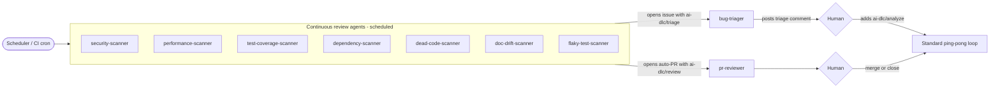
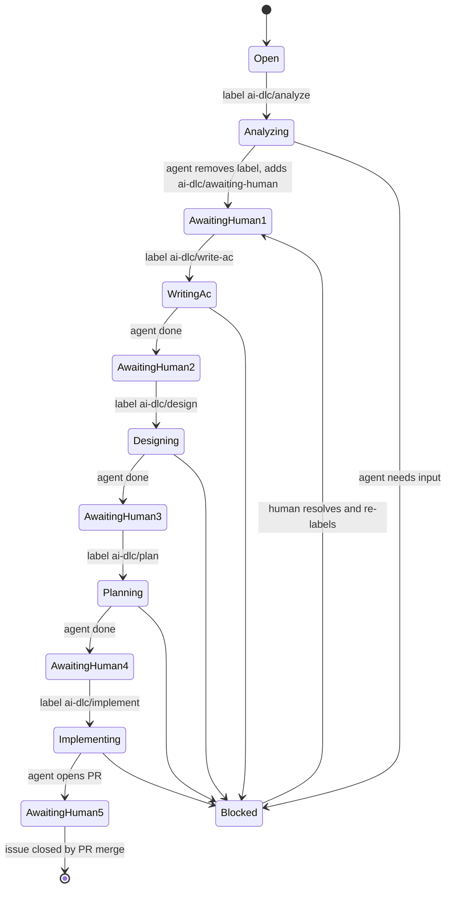
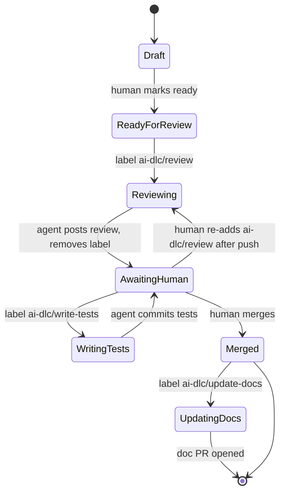
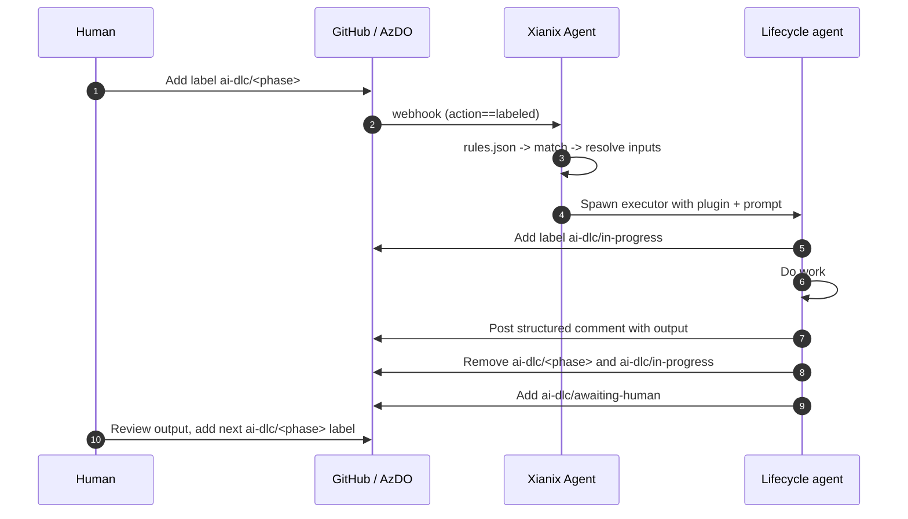
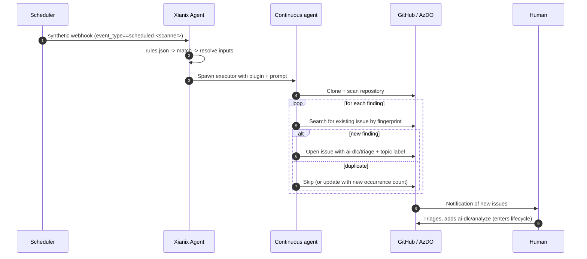

# AI-DLC Ping-Pong Process

A unified, **tag-driven** event model for the Xianix AI-DLC. Every handoff between a human and a lifecycle AI agent is a single, explicit label change on a GitHub issue / PR (or the equivalent tag on an Azure DevOps work item / PR). Alongside the lifecycle, a separate class of **continuous review agents** runs on a schedule, scans the repository on its own, and escalates findings into the lifecycle by opening new issues or PRs.

This document supersedes the existing assignment-based and reviewer-based triggers in [TheAgent/Knowledge/rules.json](../TheAgent/Knowledge/rules.json).

---

## 1. Design principles

1. **Two agent classes.**
   - **Lifecycle agents** are label-triggered, on-demand, and live inside the human↔AI ping-pong.
   - **Continuous review agents** run on a schedule, find work themselves, and *enter* the ping-pong by opening labelled issues / PRs.
2. **Lifecycle trigger model: labels only.** Every lifecycle agent fires on `action==labeled` (GitHub) or a `System.Tags` change (Azure DevOps). No more `assignee.login=='xianix-agent'` or `requested_reviewer.login=='xianix-agent'`.
3. **Humans set the lifecycle pace.** A human always applies the *next* phase label. Lifecycle agents never auto-advance.
4. **Lifecycle agents are idempotent and self-cleaning.** When a lifecycle agent finishes, it (a) removes its own trigger label, (b) posts a structured comment with its output, and (c) leaves the issue/PR in `ai-dlc/awaiting-human`.
5. **Continuous agents escalate, never act silently.** Every finding becomes a new GitHub issue (or PR comment) with an appropriate `ai-dlc/*` label so the lifecycle can pick it up.
6. **One label per phase.** No combinatorial labels. The label namespace is `ai-dlc/`.
7. **No self-review loops.** Lifecycle agents must skip when the issue/PR author is `xianix-agent` unless an explicit `ai-dlc/force` label is present.

---

## 2. Agent catalog

### 2.1 Lifecycle agents (label-triggered ping-pong)

These agents form the linear ping-pong. Each one is triggered by a single label, does its work, removes the label, and hands back to the human.

#### Issue-phase agents

| Label | Agent | Output |
|---|---|---|
| `ai-dlc/analyze` | `req-analyst` | Elaborated requirements, scope, open questions |
| `ai-dlc/write-ac` | `ac-writer` | Gherkin acceptance criteria |
| `ai-dlc/design` | `solution-architect` | Draft ADR PR + component sketch |
| `ai-dlc/plan` | `task-planner` | Linked child issues with AC copied in |
| `ai-dlc/implement` | `implementer` | Branch + draft PR with code and tests |
| `ai-dlc/triage` | `bug-triager` | Severity, repro questions, owner suggestion |
| `ai-dlc/postmortem` | `postmortem-writer` | Postmortem document PR |

#### PR-phase agents

| Label | Agent | Output |
|---|---|---|
| `ai-dlc/review` | `pr-reviewer` | PR review comments + summary |
| `ai-dlc/write-tests` | `test-author` | Commits / suggests additional tests on the PR |
| `ai-dlc/update-docs` | `doc-writer` | Follow-up PR updating `Docs/` and READMEs |

### 2.2 Continuous review agents (scheduled, autonomous)

These agents are **not** triggered by user labels. They run on a schedule (or on push to `main`), scan the repository themselves, and escalate every finding by opening a new GitHub issue (or PR comment) tagged with an appropriate lifecycle label so the ping-pong picks it up.

| Agent | Cadence (suggested) | Scope | Escalation output |
|---|---|---|---|
| `security-scanner` | nightly + on push to `main` | source, dependencies, IaC, secrets | New issue, labels `bug`, `security`, `ai-dlc/triage` |
| `performance-scanner` | weekly | hot paths, N+1 queries, allocations, bundle size | New issue, labels `performance`, `ai-dlc/triage` |
| `test-coverage-scanner` | nightly | uncovered branches, missing edge-case tests | New issue, labels `testing`, `ai-dlc/triage` (or PR with `ai-dlc/review` if it can author the test itself) |
| `dependency-scanner` | daily | outdated packages, deprecated APIs, CVEs | New issue, labels `dependencies`, `ai-dlc/triage`; auto-PR with `ai-dlc/review` for safe bumps |
| `dead-code-scanner` | weekly | unreferenced symbols, unused exports | New issue, label `cleanup`, `ai-dlc/triage` |
| `doc-drift-scanner` | weekly | README / Docs out of sync with code | New issue, label `docs`, `ai-dlc/triage` |
| `flaky-test-scanner` | continuous (CI hook) | tests that fail intermittently across CI runs | New issue, label `flaky`, `ai-dlc/triage` |

Each continuous agent obeys the same escalation contract (see §7.2): one issue per finding, deduplication via a stable fingerprint in the issue body, never opens a duplicate.

### 2.3 Status labels (set by lifecycle agents, never trigger anything)

| Label | Meaning |
|---|---|
| `ai-dlc/in-progress` | A lifecycle agent is currently running |
| `ai-dlc/awaiting-human` | A lifecycle agent finished and is waiting for the human to take the next step |
| `ai-dlc/blocked` | The agent could not proceed and posted a question — human input required |
| `ai-dlc/done` | The pipeline has reached a terminal state for this artifact |

### 2.4 Modifier labels (optional, change agent behaviour)

| Label | Meaning |
|---|---|
| `ai-dlc/force` | Bypass safety checks (e.g. self-review block) |
| `ai-dlc/dry-run` | Agent posts what it would do without making writes |

---

## 3. End-to-end ping-pong flow (lifecycle)

```mermaid
flowchart TD
    Start([Human files issue]) --> A1[Human adds label: ai-dlc/analyze]
    A1 --> AG1[req-analyst]
    AG1 -->|removes label, posts elaborated reqs| H1{Human reviews}
    H1 -->|approves| L1[Human adds label: ai-dlc/write-ac]
    L1 --> AG2[ac-writer]
    AG2 -->|removes label, posts Gherkin AC| H2{Human reviews}
    H2 -->|approves| L2[Human adds label: ai-dlc/design]
    L2 --> AG3[solution-architect]
    AG3 -->|removes label, opens ADR PR| H3{Human reviews ADR}
    H3 -->|merges ADR| L3[Human adds label: ai-dlc/plan]
    L3 --> AG4[task-planner]
    AG4 -->|removes label, creates child issues| H4{Human grooms backlog}
    H4 -->|picks child issue| L4[Human adds label: ai-dlc/implement]
    L4 --> AG5[implementer]
    AG5 -->|removes label, opens draft PR| H5{Human inspects diff}
    H5 -->|ready| L5[Human adds label: ai-dlc/review on PR]
    L5 --> AG6[pr-reviewer]
    AG6 -->|removes label, posts review| H6{Human merges?}
    H6 -->|merge| Done([Tag pushed = release])
```



---

## 4. Continuous review agents enter the lifecycle

Continuous agents are upstream producers. They never sit *inside* the ping-pong; they create the issues that *start* it.



Key property: continuous agents have **write access to issues / PRs only** — they never push to branches that are not their own scanner branch, and every finding is human-acknowledged before any code change is merged.

---

## 5. Issue state machine (lifecycle)

The same issue moves through phases purely by label transitions. Any phase can also be skipped by jumping straight to the next label.



---

## 6. PR state machine (lifecycle)



---

## 7. Agent contracts

### 7.1 Lifecycle agent contract



Output comment format (suggested):

```markdown
## ai-dlc/<phase> result

**Summary:** one-line outcome.

**Artifacts:**
- link or inline content

**Suggested next step:** add label `ai-dlc/<next-phase>` to continue, or `ai-dlc/blocked` if you need me to stop.
```

### 7.2 Continuous review agent contract



Each finding's body must include a `<!-- ai-dlc-fingerprint: <stable-hash> -->` HTML comment so reruns can detect duplicates without spamming.

---

## 8. Trigger reference

GitHub triggers use `action==labeled&&label.name=='<label>'`. Azure DevOps triggers use `eventType==workitem.updated&&resource.fields."System.Tags".newValue*='<label>'` for work items, and `eventType==git.pullrequest.updated&&resource.labels.*.name=='<label>'` for PRs. The expression syntax is documented in [Docs/rules-json.md](rules-json.md).

### 8.1 Lifecycle agents — issue triggers

| Agent | GitHub rule | Azure DevOps rule |
|---|---|---|
| `req-analyst` | `action==labeled&&label.name=='ai-dlc/analyze'` | `eventType==workitem.updated&&resource.fields."System.Tags".newValue*='ai-dlc/analyze'` |
| `ac-writer` | `action==labeled&&label.name=='ai-dlc/write-ac'` | `... .newValue*='ai-dlc/write-ac'` |
| `solution-architect` | `action==labeled&&label.name=='ai-dlc/design'` | `... .newValue*='ai-dlc/design'` |
| `task-planner` | `action==labeled&&label.name=='ai-dlc/plan'` | `... .newValue*='ai-dlc/plan'` |
| `implementer` | `action==labeled&&label.name=='ai-dlc/implement'` | `... .newValue*='ai-dlc/implement'` |
| `bug-triager` | `action==labeled&&label.name=='ai-dlc/triage'` | `... .newValue*='ai-dlc/triage'` |
| `postmortem-writer` | `action==labeled&&label.name=='ai-dlc/postmortem'` | `... .newValue*='ai-dlc/postmortem'` |

### 8.2 Lifecycle agents — PR triggers

| Agent | GitHub rule | Azure DevOps rule |
|---|---|---|
| `pr-reviewer` | `action==labeled&&label.name=='ai-dlc/review'` | `eventType==git.pullrequest.updated&&resource.labels.*.name=='ai-dlc/review'` |
| `test-author` | `action==labeled&&label.name=='ai-dlc/write-tests'` | `... .name=='ai-dlc/write-tests'` |
| `doc-writer` | `action==labeled&&label.name=='ai-dlc/update-docs'` | `... .name=='ai-dlc/update-docs'` |

### 8.3 Continuous review agents — scheduled triggers

Continuous agents are not driven by repository events. They are driven by **synthetic webhooks** emitted by a scheduler. The recommended source is a single GitHub Actions workflow (per repo) running on `schedule:` cron, sending `repository_dispatch` events. Azure DevOps equivalent: a scheduled pipeline using `az devops invoke` or a Service Hooks subscription fed by an Azure Function timer.

Synthetic event shape (GitHub `repository_dispatch`):

```json
{
  "action": "scheduled-security-scan",
  "event_type": "scheduled-security-scan",
  "client_payload": {
    "scanner": "security-scanner",
    "scope": "full"
  },
  "repository": { "clone_url": "...", "full_name": "..." }
}
```

| Agent | GitHub rule | AzDO rule |
|---|---|---|
| `security-scanner` | `event_type==scheduled-security-scan` | `eventType==scheduled.scan&&resource.scanner=='security-scanner'` |
| `performance-scanner` | `event_type==scheduled-performance-scan` | `eventType==scheduled.scan&&resource.scanner=='performance-scanner'` |
| `test-coverage-scanner` | `event_type==scheduled-coverage-scan` | `eventType==scheduled.scan&&resource.scanner=='test-coverage-scanner'` |
| `dependency-scanner` | `event_type==scheduled-dependency-scan` | `eventType==scheduled.scan&&resource.scanner=='dependency-scanner'` |
| `dead-code-scanner` | `event_type==scheduled-deadcode-scan` | `eventType==scheduled.scan&&resource.scanner=='dead-code-scanner'` |
| `doc-drift-scanner` | `event_type==scheduled-doc-drift-scan` | `eventType==scheduled.scan&&resource.scanner=='doc-drift-scanner'` |
| `flaky-test-scanner` | `workflow_run.conclusion=='failure'` (CI hook) or `event_type==scheduled-flaky-scan` | CI build complete event |

A reference cron workflow lives at `Scripts/scheduler/ai-dlc-scanners.yml` (to be added).

---

## 9. Inputs to extract from each event

All label-driven rules share an almost-identical `use-inputs` block.

For **GitHub issues**:

```json
"use-inputs": [
  { "name": "issue-number",    "value": "issue.number" },
  { "name": "issue-title",     "value": "issue.title" },
  { "name": "repository-url",  "value": "repository.clone_url" },
  { "name": "repository-name", "value": "repository.full_name" },
  { "name": "trigger-label",   "value": "label.name" },
  { "name": "platform",        "value": "github", "constant": true }
]
```

For **GitHub PRs**:

```json
"use-inputs": [
  { "name": "pr-number",       "value": "pull_request.number" },
  { "name": "pr-title",        "value": "pull_request.title" },
  { "name": "pr-head-branch",  "value": "pull_request.head.ref" },
  { "name": "repository-url",  "value": "repository.clone_url" },
  { "name": "repository-name", "value": "repository.full_name" },
  { "name": "trigger-label",   "value": "label.name" },
  { "name": "platform",        "value": "github", "constant": true }
]
```

For **GitHub `repository_dispatch` (continuous scanners)**:

```json
"use-inputs": [
  { "name": "scanner",         "value": "client_payload.scanner" },
  { "name": "scope",           "value": "client_payload.scope" },
  { "name": "repository-url",  "value": "repository.clone_url" },
  { "name": "repository-name", "value": "repository.full_name" },
  { "name": "platform",        "value": "github", "constant": true }
]
```

For **Azure DevOps work items**:

```json
"use-inputs": [
  { "name": "workitem-id",     "value": "resource.workItemId" },
  { "name": "workitem-title",  "value": "resource.revision.fields.\"System.Title\"" },
  { "name": "workitem-type",   "value": "resource.revision.fields.\"System.WorkItemType\"" },
  { "name": "project-name",    "value": "resource.revision.fields.\"System.TeamProject\"" },
  { "name": "tags",            "value": "resource.fields.\"System.Tags\".newValue" },
  { "name": "platform",        "value": "azuredevops", "constant": true }
]
```

---

## 10. Migration from the existing rules

The current [TheAgent/Knowledge/rules.json](../TheAgent/Knowledge/rules.json) uses three trigger styles that all need to be replaced:

| Current trigger (to remove) | Replaced by (new label) |
|---|---|
| `action==assigned&&assignee.login=='xianix-agent'` (issue) | `action==labeled&&label.name=='ai-dlc/analyze'` |
| `eventType==workitem.updated&&resource.fields."System.AssignedTo".newValue=='xianix-agent <xianix-agent@99x.io>'` | tag `ai-dlc/analyze` on the work item |
| `action==review_requested&&requested_reviewer.login=='xianix-agent'` (PR) | `action==labeled&&label.name=='ai-dlc/review'` |
| `action==opened&&pull_request.requested_reviewers.*.login=='xianix-agent'` | dropped — humans must explicitly add `ai-dlc/review` |
| `action==synchronize&&pull_request.requested_reviewers.*.login=='xianix-agent'` | dropped — humans re-add the label to request a re-review |
| `eventType==git.pullrequest.updated&&resource.reviewers.*.displayName=='xianix-agent'` (AzDO) | PR tag `ai-dlc/review` |

Net effect: the existing two agents remain (`req-analyst`, `pr-reviewer`) but are re-triggered. Eight new lifecycle agents and seven continuous scanners drop into the same `rules.json` shape (the latter under new `repository_dispatch` rules).

---

## 11. Open questions to resolve before building

1. **Re-review on push.** Today the `pr-reviewer` automatically re-runs on `synchronize`. Under the label model, the human must re-add `ai-dlc/review` after each push. Acceptable, or do we want an opt-in modifier label like `ai-dlc/review-on-push`?
2. **Scheduler ownership.** GitHub Actions cron (per-repo, simple, free) vs. a central Azure Function (one source of truth, easier to throttle, requires shared secret). Recommend GitHub Actions for v1.
3. **Continuous-agent rate limits.** Each scanner can open many issues on its first run against a legacy repo. Need a per-run cap (e.g. max 10 new issues per scanner per run) and dedup via fingerprint.
4. **Auto-PR vs. always-issue.** Should `dependency-scanner` open auto-PRs for safe semver bumps (label `ai-dlc/review`), or always go through an issue first? Recommend auto-PR for patch bumps only.
5. **Agent-removes-label permission.** Removing labels needs `issues: write` / `pull-requests: write`. Confirm the `GITHUB-TOKEN` and `AZURE-DEVOPS-TOKEN` already used in [TheAgent/Knowledge/rules.json](../TheAgent/Knowledge/rules.json) have those scopes.
6. **Label seeding.** New repos need the `ai-dlc/*` labels created. Either ship a `Scripts/seed-labels.sh` for GitHub (and an AzDO equivalent), or have the first agent invocation auto-create missing labels.
7. **Bug auto-triage.** Should opening an issue with the `bug` label automatically apply `ai-dlc/triage`, or do humans always do that? Recommend: human explicit, to keep the "label = consent" invariant — except when a continuous scanner opens the issue itself, in which case the scanner adds `ai-dlc/triage` directly.
8. **Concurrency.** Adding two phase labels at once will fire two executions in parallel (per the existing scheduler in [TheAgent/Workflows/ProcessingWorkflow.cs](../TheAgent/Workflows/ProcessingWorkflow.cs)). For a linear pipeline this is unwanted; we may want a per-issue mutex or simply trust the human to apply one label at a time.
