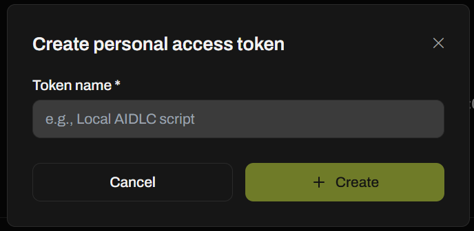
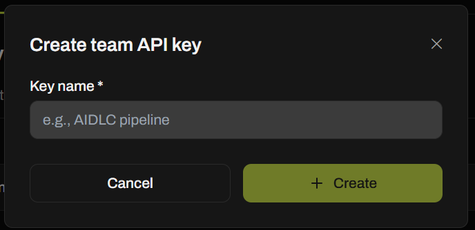
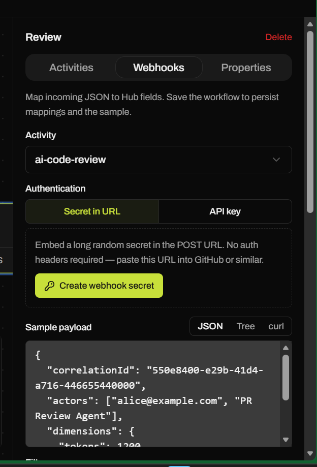
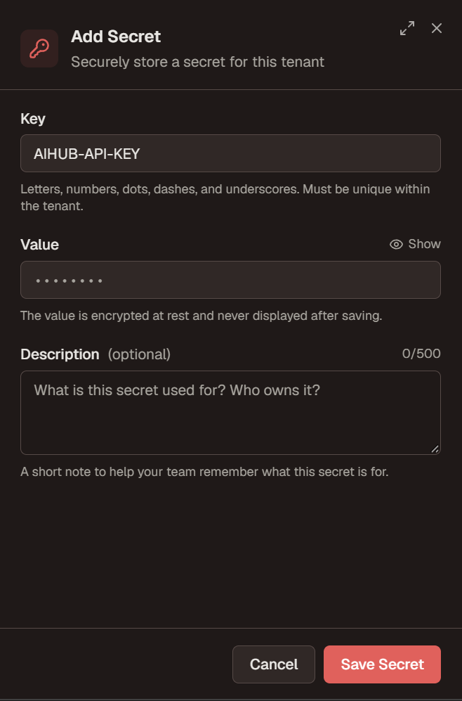

# AI Hub configuration (Xianix)

Short guide to send Xianix execution metrics to [99x AI Hub](https://ai-hub.99x.io/) via `raise-events` in `rules.json`.

See also: [`rules-json.md` → `raise-events`](rules-json.md).

---

## Before you start

You need:

- Access to [AI Hub](https://ai-hub.99x.io/)
- Access to **Agent Studio** for your tenant (to add secrets and edit Rules)

You will **not** look up node ID or activity ID by hand. Create a webhook in AI Hub and **copy the URL** it gives you.

---

## 1. Create an AI Hub token

Pick **one**:

### Option A — Personal access token

1. Open [Profile settings](https://ai-hub.99x.io/settings/#profile).
2. Create a personal access token.
3. Name it (for example `Local AIDLC script`) → **+ Create**.
4. Copy the token once.



### Option B — Team API key

1. Open [Team → API keys](https://ai-hub.99x.io/teams/?teamId=1&tab=apikeys).
2. Create a team API key.
3. Name it (for example `AIDLC pipeline`) → **+ Create**.
4. Copy the key once.



---

## 2. Create the webhook and copy the URL

1. In AI Hub, open the **node** that should receive metrics (for example **Review**).
2. Open the **Webhooks** tab.
3. Select the **Activity** (for example `ai-code-review`).
4. Choose auth and copy the URL AI Hub shows (your IDs will differ):

| Auth | URL shape |
| --- | --- |
| **API key** | `https://ai-hub-api.99x.io/metrics/nodes/<nodeId>/node-activities/<activityId>/events` |
| **Secret in URL** | `https://ai-hub-api.99x.io/metrics/nodes/<nodeId>/node-activities/<activityId>/<whs_…>/events` |

Examples:

```text
# API key — send X-Api-Key header (step 1 + 3)
https://ai-hub-api.99x.io/metrics/nodes/nd_9lcgvLaCAP/node-activities/na_NfPIrObtec/events

# Secret in URL — secret is the whs_… segment; no auth header
https://ai-hub-api.99x.io/metrics/nodes/nd_9lcgvLaCAP/node-activities/na_NfPIrObtec/whs_a67b5ed1947cde1e8ef62068109f8f0bc2a95ae93bc1d20eccdb83f5ac4b8898/events
```

5. Click **Create webhook secret** when using **Secret in URL** (or create/copy for **API key**).
6. **Copy that URL** into `rules.json` as-is. Do not build node / activity IDs by hand.



---

## 3. Store the token in Xianix

In Agent Studio → **Secrets**, add:

| Key | Value |
| --- | --- |
| `AIHUB-API-KEY` | the personal token or team key from step 1 |



Skip this step only if you chose **Secret in URL** and the secret is already embedded in the copied URL.

---

## 4. Wire `raise-events` in `rules.json`

On each execution that should report to AI Hub, paste the **copied webhook URL** into `url`.

### If Webhooks auth is **API key**

Needs step 1 token + `AIHUB-API-KEY` secret. URL has **no** `whs_…` segment:

```json
"raise-events": [
  {
    "name": "ai-hub-metrics",
    "url": "https://ai-hub-api.99x.io/metrics/nodes/nd_9lcgvLaCAP/node-activities/na_NfPIrObtec/events",
    "with-headers": [
      {
        "name": "X-Api-Key",
        "value": "secrets.AIHUB-API-KEY",
        "mandatory": true
      }
    ],
    "payload": [
      {
        "correlationId": "{{correlationId}}",
        "actors": ["{{plugin-name}}"],
        "dimensions": {
          "tokens": "{{metrics.tokens.total}}",
          "costUsd": "{{metrics.cost-usd}}",
          "model": "{{metrics.model}}",
          "status": "{{metrics.status}}"
        }
      }
    ]
  }
]
```

### If Webhooks auth is **Secret in URL**

No `X-Api-Key` header. URL includes the `whs_…` secret:

```json
"raise-events": [
  {
    "name": "ai-hub-metrics",
    "url": "https://ai-hub-api.99x.io/metrics/nodes/nd_9lcgvLaCAP/node-activities/na_NfPIrObtec/whs_a67b5ed1947cde1e8ef62068109f8f0bc2a95ae93bc1d20eccdb83f5ac4b8898/events",
    "payload": [
      {
        "correlationId": "{{correlationId}}",
        "actors": ["{{plugin-name}}"],
        "dimensions": {
          "tokens": "{{metrics.tokens.total}}",
          "costUsd": "{{metrics.cost-usd}}",
          "model": "{{metrics.model}}",
          "status": "{{metrics.status}}"
        }
      }
    ]
  }
]
```

Save Rules (agent scope).

---

## 5. Verify

1. Trigger one matching webhook execution.
2. Confirm an event appears on that AI Hub activity.

Events are raised **after** the run finishes and are best-effort (a failed POST does not fail the run).
