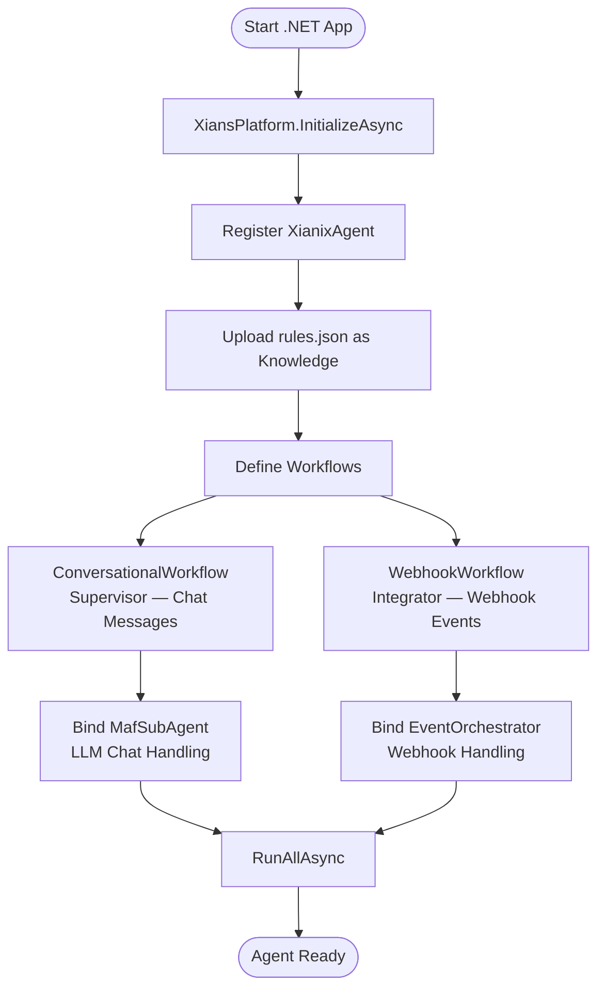
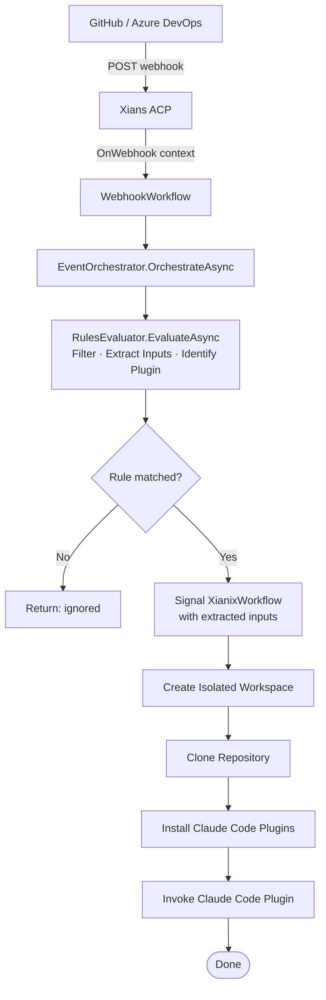
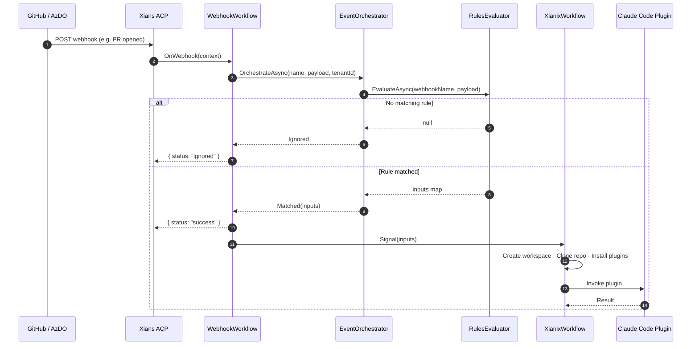
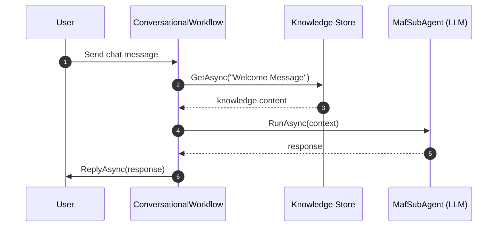

# Xianix Agent Architecture

## Architecture objectives

- Be centered around the Git repository for initial set of agents
- Ability to create sophisticated agents
- Agent should be centrally governed, not on the IDE of a developer
- Easily bring in custom agents to extend the agent architecture ***
- Support different CM platforms like gitHub, gitlabs, Azure Devops ***
- Isolation levels (tenant, repo) ***
- Platform to support non-coding agents such as for marketing, HR, etc.
- Monitoring, visibility and quota allocations
- Human<->Agent ping-pong process
- Quality over cost??

## Overall Flow

### Agent Activated

Configuration: rules.json
Workflows inputs: Repo Git URL

start XianixWorkflow -> Create Isolated Workspace for tenant

### Event occurred

GitHub/Azure DevOps -> Xians ACP -> Agent DotNet Console Application -> Orchastrator

Orchastrator -> Via Rule.json (Fileter Events, Extract Inputs, Identify Claude Code Plugin to Invoke) -> Signal XianixWorkflow

XianixWorkflow Signal -> Clone repository -> Install Claude Code Plugins -> Invoke Claude Code Plugin

---

## Diagrams

### Agent Activation Flow

---

### Webhook Event Flow

---

### Sequence: Webhook Event End-to-End

---

### Sequence: Chat Message Handling

