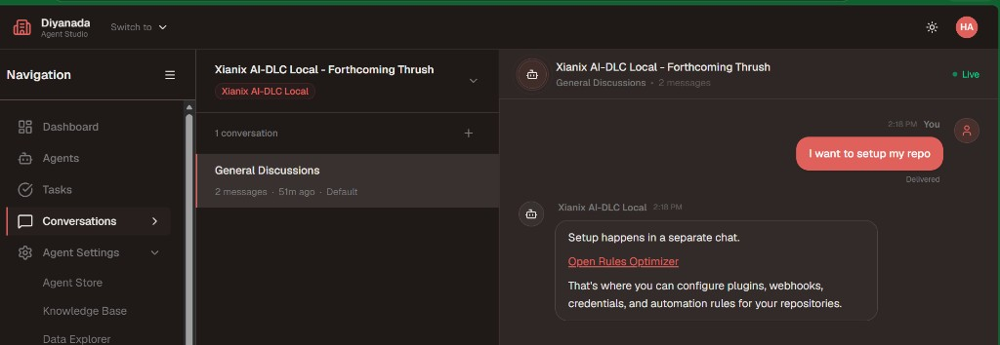
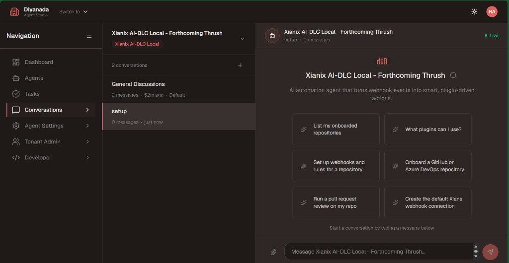

# Onboard a repository

Simple guide for adding a GitHub or Azure DevOps repo through the **onboarding agent** (Rules Optimizer) in Agent Studio.

This walkthrough installs plugins, stores the repo URL, checks secrets, and creates the **inbuilt** Xians webhook under Agent Settings → Connections. You do **not** create a webhook on GitHub or Azure DevOps.

---

## Before you start

You need:

- Access to **Agent Studio** and the Xianix agent for your tenant
- The **HTTPS clone URL** of the repo (for example `https://github.com/org/repo.git` or an Azure DevOps `_git` URL)
- Permission to add secrets in Studio and to create the inbuilt webhook under Agent Settings → Connections

Have these ready (add only what is missing when the agent asks):

| Secret key | Used for |
| --- | --- |
| `ANTHROPIC-API-KEY` | Model calls during plugin runs |
| `GITHUB-TOKEN` | GitHub clone and plugin access (typical scopes: `repo`, `workflow`) |
| `AZURE-DEVOPS-TOKEN` | Azure DevOps clone and plugin access |

Do **not** paste token values into chat. Add them in Studio secrets, then tell the agent `done`.

---

## 1. Open the agent and ask to set up the repo

1. Sign in to Agent Studio.
2. Open the Xianix agent and go to **Conversations**.
3. In **General Discussions**, say you want to set up the repo — for example `I want to setup my repo`.
4. The agent replies that setup happens in a separate chat. Click **Open Rules Optimizer**.

---

## 2. Continue in the setup chat

Clicking the link opens a **setup** conversation. That chat **is** the onboarding agent.

Use a starter such as **Set up webhooks and rules for a repository** or **Onboard a GitHub or Azure DevOps repository**, or type the clone URL.

Stay in this **setup** conversation for the rest of the steps.

---

## 3. Give the clone URL

Paste the **full HTTPS clone URL**. Do not invent or shorten it.

Examples:

- GitHub: `https://github.com/org/repo.git`
- Azure DevOps: `https://dev.azure.com/org/project/_git/repo`

The agent infers the platform from the host (`github.com` → GitHub, `dev.azure.com` / `*.visualstudio.com` → Azure DevOps). Confirm if it asks (self-hosted hosts need this).

---

## 4. Pick plugins

The agent lists marketplace plugins that are ready to install (for example PR review).

1. Choose the plugin(s) you want.
2. Confirm before it installs anything.

Skip plugins that are marked coming soon.

---

## 5. Confirm webhook triggers

The agent lists suggested triggers for those plugins (execution names + match rules).

1. Read the list.
2. Tell it which triggers to enable.
3. Wait until you have confirmed — it should not write webhook executions before that.

You can defer triggers if you only want the plugin installed for chat for now.

---

## 6. Add missing secrets

The agent checks the tenant vault. It only asks for keys that are **missing**.

1. Open **Studio → Settings → Secrets** (Agent Settings → Secrets).
2. Add each missing key with the **exact** name (`GITHUB-TOKEN`, `AZURE-DEVOPS-TOKEN`, `ANTHROPIC-API-KEY`, …).
3. Go back to chat and say `done`.

Never paste the secret value into the chat.

---

## 7. Let the agent install

After plugins, triggers, and secrets are confirmed, the agent installs into **agent-scoped** `rules.json`.

You are done with this step only when it says the plugin was installed (not “already configured”, and not an error).

---

## 8. Create the inbuilt Default webhook

When the agent asks to create the webhook, say **yes** (or “create webhook”).

This is the only webhook step. The agent creates the **inbuilt** Xians connection under **Agent Settings → Connections → Default webhook**. It does not create a GitHub or Azure DevOps webhook.

Use the **webhook URL it prints in that same turn**. Do not reuse an older URL from earlier in the chat.

---

## Done

The repo is onboarded when:

- The clone URL is stored for this activation
- The chosen plugins show as installed
- Secrets for that platform are present
- **Connections** shows the inbuilt Default webhook

You can now run a plugin from the main (non-setup) chat.

---

## If it fails

| What you see | What to do |
| --- | --- |
| Agent asks for the URL again | Paste the full HTTPS clone URL. Do not type only the repo name. |
| Plugin “already configured” | It was already installed. Continue to webhook / secrets if those are still missing. |
| Install did not update `rules.json` | Stay in the **activation** setup chat and retry. Do not treat a tool error as success. |
| Missing `GITHUB-TOKEN` / `AZURE-DEVOPS-TOKEN` | Add the key in Secrets, then say `done`. |
| GitHub “repository not found” later | URL is wrong, **or** the token cannot see a private repo. Hosts look the same for both cases. |
| Webhook URL looks like an old tunnel host | Ask the agent to create the webhook again and use only the latest URL. |
